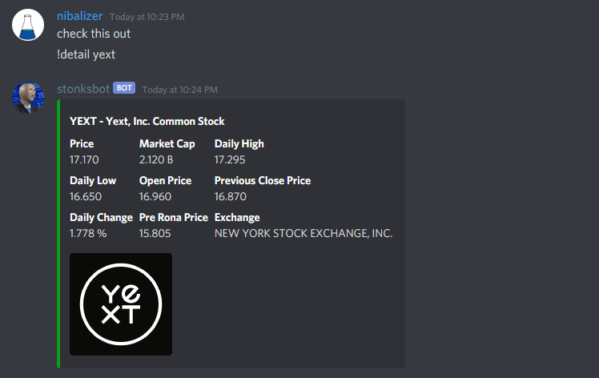

# Discord Stonks Bot

Query stock ticker information from discord

# Commands

`!q foo`
`!quote foo`
`!q foo,bar,baz`
`!detail aapl`

# Notes

* Uses the Finnhub API, requires a finnhub account
* See `example_config.txt` for environment variables to pass to docker
* Run with `docker run --env-file foo.txt` 
* Requires `stonksdata.txt` which can be generated from scripts [here](https://github.com/nibalizer/stonksapi/blob/main/contrib/get_stonks_db.sh)

